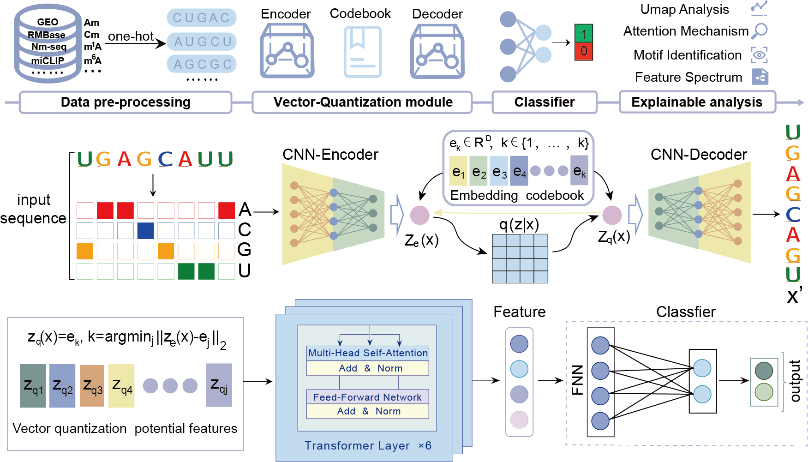

# VQRNA
A VQ-VAE-based deep learning model for comprehensive prediction and interpretation of multiple types of RNA modification


# Introduction
RNA modifications play crucial roles in gene regulation and translation, with their abnormalities closely linked to various diseases. Accurate identification of RNA modification sites is therefore essential. We present VQ-RNA, a deep learning approach based on the Vector Quantized Variational Autoencoder (VQ-VAE) framework. Its vector-quantization module generates discrete latent embeddings of RNA modifications, constructing an informative latent representation space for comprehensive prediction and interpretation of multiple RNA modifications. VQ-RNA supports site prediction for ten common RNA modifications (Am, Cm, Gm, Um, m1A, m5C, m5U, m6A, m6Am, Ψ) and offers extensive interpretability analyses. Leveraging the discrete latent embeddings generated from the codebook, our model identifies informative motif patterns and generates feature spectrum for each RNA modification, uncovering their specificities. Our work provides a novel tool and perspective for RNA modification research, facilitating a deeper understanding of their functions in gene regulation and disease.

# Installation
**1.Base environment installation**

It is recommended to use conda to manage Python dependencies. Since this project relies on CUDA 12 libraries, please ensure that your CUDA version is compatible (you can check it using `nvidia-smi` or `nvcc -V`).
You should install Python 3.8 or later. You can install Python using conda.
```  
conda create -n myenv python=3.8 -y
# activate the installed environment
conda activate VQRNA
```
**2.Install tangermeme**
``` 
pip install tangermeme
# use tangermeme to draw motif
from tangermeme.ism import saturation_mutagenesis
```

# Usage
### Input   
* fasta file

### Run and reproduce   
**1.Use `train_VQRNA.py` to reproduce the results of VQRNA on benchmark datasets in our manuscript with a sequence input length of 501 bp.**
```  
$ python train_VQRNA.py
```
**2.Use `train_mymodelLength.py` in the `length` directory to run the model on sequences of 51bp, 101bp, 201bp, 301bp, 401bp, 701bp, 901bp and 1001bp input lengths.**
```  
$ python train_mymodelLength.py
```
**3.Use `draw_ISM_motif.py` in the `Identify_motif` directory to visualize motifs identified by VQ-RNA based on ISM analysis.**
```  
$ python draw_ISM_motif.py
```
**4.Use `feature_spectrum.py` in the `generate_feature_spectrum` directory to generate feature spectrum that reveal the specificity of each RNA modification.**
```  
$ python feature_spectrum.py
```
**5.Use `config.yaml` in the `find_parameter` directory to search for the optimal hyperparameters.**
```  
$ nnictl create --config config.yaml -p 8080
```

### Output
The Output will be saved in the following forms:
* **.pth file:** saved model to reproduce results.
* **.log file:** saved model's performance, including ACC, SE, SP, MCC, AUC and so on.
* **Importance_Score.svg:** saved the importance scores for each position in the sequence based on ISM analysis.
* **motifs_combined.svg:** saved motifs visualization for the entire sequence range.
* **tf_idf_matrix_sorted.csv:** saved TF-IDF matrix, which is sorted by specificity score.
* **VQRNA_feature_spectrum.svg:** saved feature spectrum of each RNA modification.


# Contact 
If you have any questions, you can contact me from the email: <202315263@mail.sdu.edu.cn>